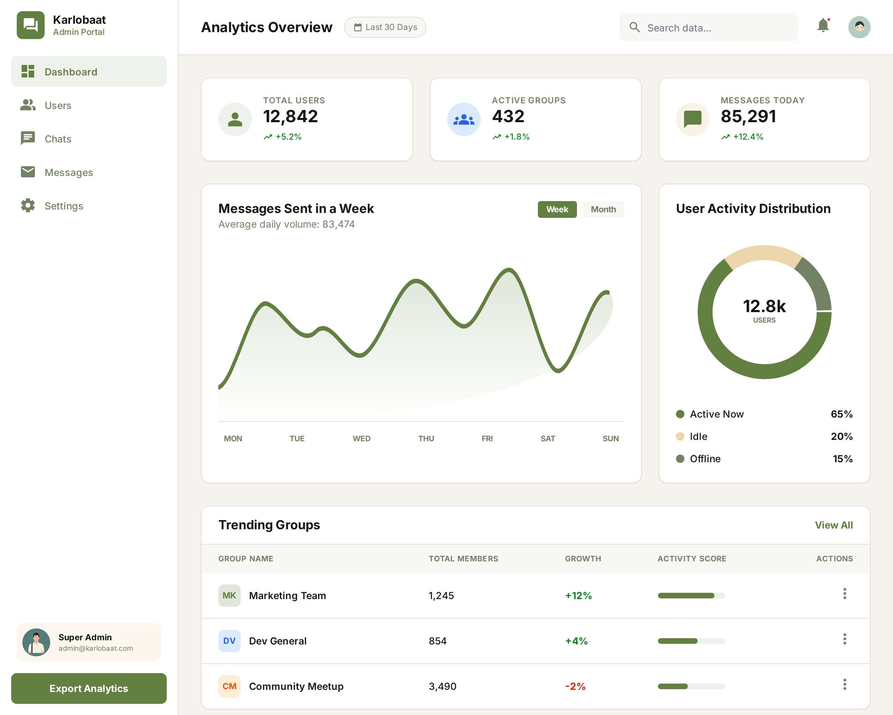
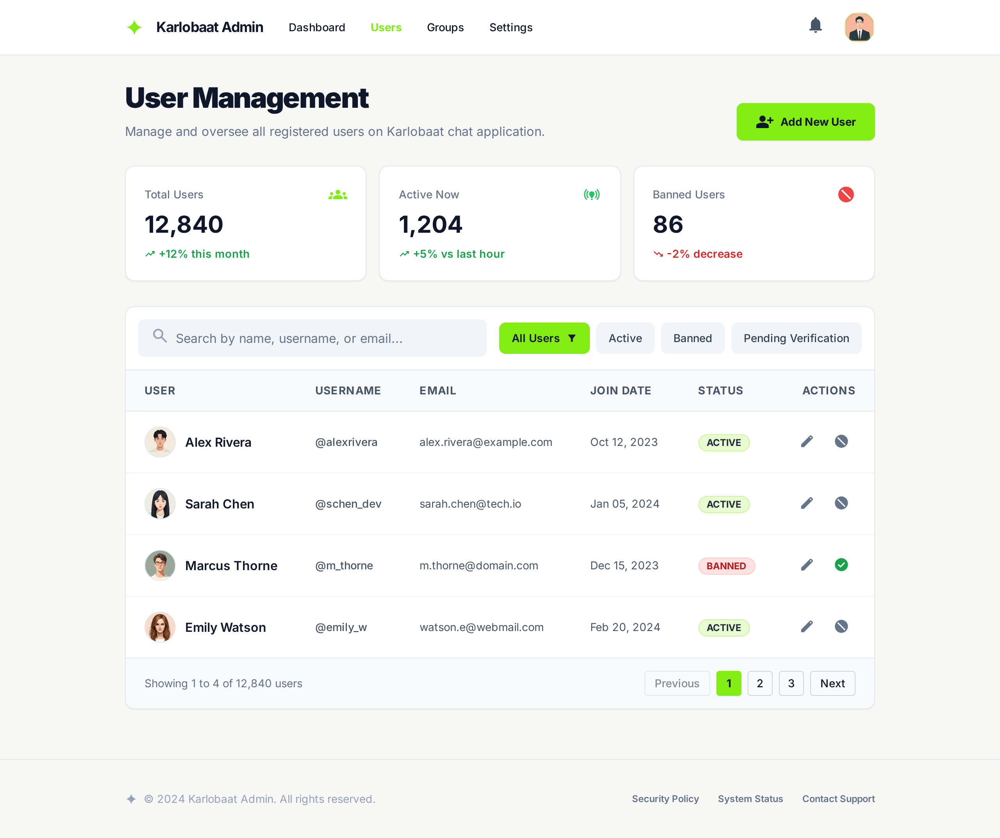
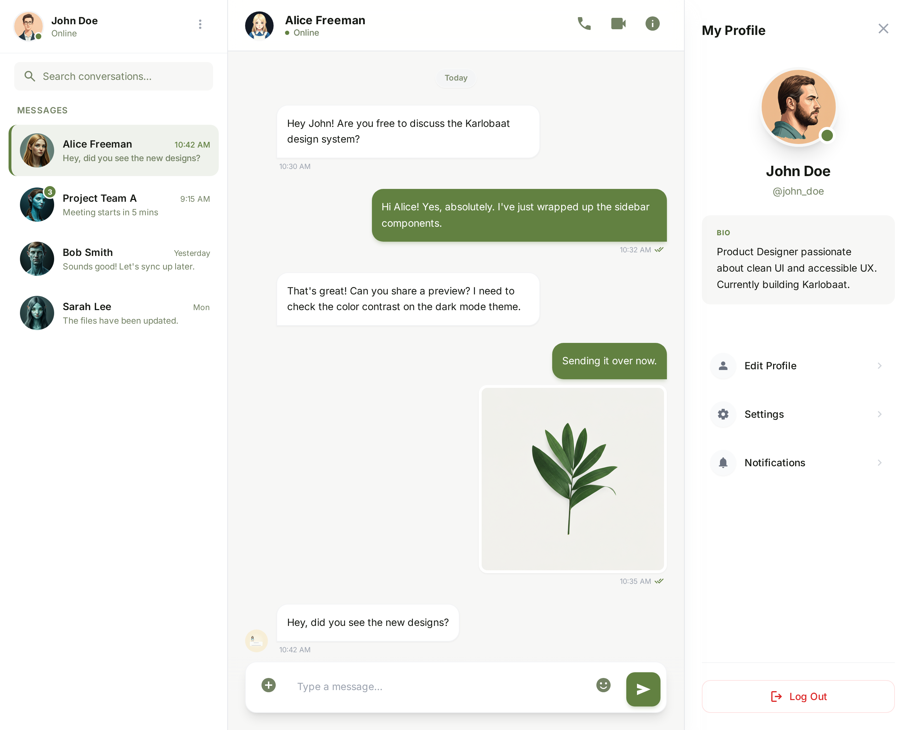

# KarloBaat Chat Application

**KarloBaat** is a real-time, feature-rich chat application built using the **MERN** stack and **Socket.io**. It's designed for seamless messaging, allowing users to communicate in real-time while enjoying a variety of useful features.

## Current Progress

- **Completed** | _Looking forward to further improvement and additional features._
- **Working on v2** | _Migrating to Typescript and Tailwindcss. Features coming (Video Call, Audio Call, Profile Management)._

## Mockups (Screenshots)

### Admin Screens




### User Screens





---

🚀 _Keep an eye on **KarloBaat** as it continues to grow and evolve!_

```

```
